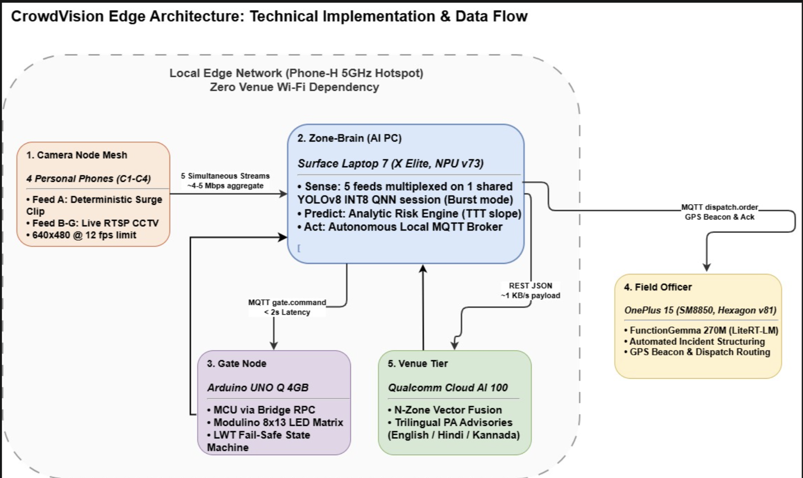

# CrowdVision — autonomous crowd-crush prevention on the Snapdragon edge
*Snapdragon Multiverse Hackathon 2026, Bengaluru · Top Prize submission*

Crowds form dangerous densities minutes before humans react. CrowdVision watches
**five camera feeds at once on a Snapdragon X Elite NPU** — one shared Hexagon
session multiplexing every stream — forecasts each zone's time-to-danger, and
**physically redirects the crowd** (Arduino gate signals + nearest-officer
dispatch on a OnePlus 15) **in under 2 seconds, fully on the edge**. Qualcomm
Cloud AI 100 adds a venue tier (multi-zone fusion, English/Hindi/Kannada PA
advisories, post-event report) that the safety loop never depends on.

**See it coming. Stop it early.**

## Team
| Name | Email |
|---|---|
| Sachin | sachin69778@gmail.com |
| Priya Kusuma | priyakusuma724@gmail.com |
| Subhasis Jena | subhasisjena42023@gmail.com |
| Santhosh S | ssanthoshs418@gmail.com |
| Swasth | swasthx.tech@gmail.com |

## Architecture


## Judges: the 5-minute path (zero hardware, zero phones)
```bash
git clone https://github.com/<org>/crowdvision && cd crowdvision
python zone-brain/scripts/download_models.py        # or --local <path>; also does `pip install -e .`
python -m crowdvision.sim --all
```
Open **http://localhost:8000** — five simulated camera feeds, live zones, a
virtual gate flipping states, and a virtual officer acknowledging dispatches.
Real hardware replaces sim components on the **same MQTT topics with zero code
changes**. (The dashboard is a URL — open it from any device on the LAN.)

## Full setup from scratch (provided hackathon hardware + any phones)
0. **Network:** any Wi-Fi hotspot. IPs in `config/devices.yaml`.
1. **AI PC** (X Elite, Windows ARM64): `zone-brain/scripts/setup.ps1`, then
   `verify_npu.py` — proves the QNN EP via `get_ep_devices()` (**not**
   `get_available_providers()`; it's a plugin EP in ORT 2.x). Run: `run_demo.ps1`.
2. **Camera nodes** (optional — sim feeds otherwise): any RTSP source at
   640×480 @ 12 fps. We used Android phones running an RTSP streamer app; the
   pipeline consumes standard RTSP and does not depend on any specific app.
   Calibrate each: `python tools/calibrate.py --camera c1` (repeat `c2..c4`);
   profiles land in `config/cameras.yaml`.
3. **Gate node** (Arduino UNO Q, powered from the PC's USB-C):
   `arduino-app-cli app start ./gate-node`  (Modulinos optional, auto-detected).
4. **Officer phone** (Android): `adb install Releases/field-app.apk`.
   FunctionGemma fetched on first run or sideloaded. A second Android = second officer.
5. **Venue tier** (optional — fully functional without it): set `AISUITE_ENDPOINT`
   / `AISUITE_KEY` in `.env`.

## Where the intelligence runs (edge-majority statement — Rules §7.c.iv)
| Function | Device | Backend |
|---|---|---|
| 5-feed density + gate-line flow | X Elite | Hexagon NPU v73, INT8, one shared QNN session, burst |
| Risk prediction | X Elite | analytic — deliberate; safety logic must be auditable |
| Gate actuation + fail-safe | UNO Q | deterministic MCU via Bridge RPC (no model; no camera ships in the kit — its gate's eye is a dedicated camera feed processed on the PC) |
| Incident structuring | OnePlus 15 | FunctionGemma 270M, LiteRT-LM, GPU (provided artifact is CPU/GPU — labeled honestly) |
| Phone NPU capability | OnePlus 15 | Gemma-4-E2B sm8750 build probed on Hexagon v81 — result + numbers in `docs/BENCHMARKS.md`; documented as the production upgrade path |
| Venue fusion + trilingual PA | Cloud AI 100 | REST — additive tier, never in the safety path |

## Benchmarks
`docs/BENCHMARKS.md` (auto-generated): NPU-vs-CPU per-frame · 5-feed sustained
aggregate inferences/s + effective fps/feed · e2e frame → gate p50/p95 ·
FunctionGemma TTFT + tok/s · hotspot throughput + RTSP drop rate · battery-delta
per power profile · committed `verify_npu.py` output.

## Tests · Notes · References
`pytest sim/tests` verifies the message loop headless.

**Notes** — privacy by design: counts, never identities; no faces stored; camera
streams never leave the local network. The camera app is an *input device*, not
code included in this submission (the pipeline consumes standard RTSP). What is
demonstrated at submission is described exactly as it runs (Rules §7.c.v) — if the
feed-mix lock leaves some cameras as looped files, this README says so; the
pipeline supports 4+ live RTSP sources.

**References** — Fruin Level-of-Service bands; Qualcomm AI Hub docs; LiteRT /
LiteRT-LM docs; forked official DevRel samples. Third-party licenses:
`THIRD_PARTY_LICENSES.md`.

## License — MIT
See `LICENSE`. Our code is MIT; third-party components keep their own licenses.
