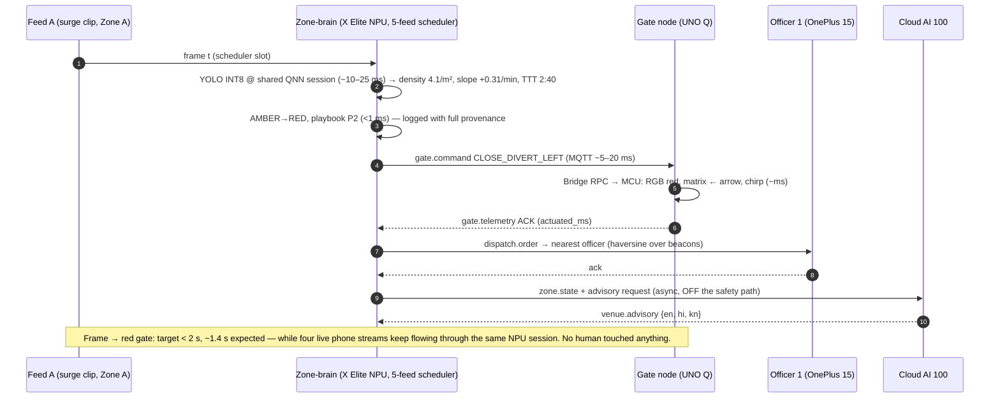

# CrowdVision — Build Plan v9 (Camera-Mesh Final)

**Event:** Snapdragon Multiverse Hackathon, Qualcomm Bldg N Café, Brookefield, Bengaluru — July 11–12, 2026
**Prize target:** Top Prize (primary) · Multi-Device Prize (second landing zone, same build)
**Supersedes:** v8. Headline change: **a 5-feed vision mesh** — 4 personal phones as RTSP camera nodes + 1 scripted surge feed — multiplexed through a single NPU session on the X Elite. Zero new purchased hardware; the doctrine (provided devices + personal phones/laptops only) holds.
**Prepared:** July 7, 2026.

**One-line:** An edge-first crowd-safety nervous system: a Snapdragon zone-brain that watches five camera feeds at once on the NPU, sees dangerous density forming minutes early, and physically redirects the crowd in under 2 seconds — no human in the loop, no packet leaving the venue.

**Tagline:** *See it coming. Stop it early.*

Honest sentence, unchanged: no plan guarantees first place; this plan guarantees no points die for preventable reasons on any of the four criteria.

---

## §0.1 — Changelog [v9]

### v9 changes (this revision)

| # | Change | Sections touched |
|---|---|---|
| 1 | **5-feed vision mesh**: 4 personal phones (C1–C4) stream RTSP to the zone-brain; Feed A stays the scripted surge clip (the kill-shot must be deterministic — you cannot stage a real dangerous crowd). Replaces "Surface webcam as Feed 2". | §b, §c, §d, §f, §g, §i, §k, §l |
| 2 | Phone role conflict resolved: Phone-H = hotspot **and Officer-2 app** (compatible roles; hotspot is background). Hotspot backup = any camera phone re-flagged in 60 s (mesh degrades to 3 cams by pre-agreement). | §0.2, §b |
| 3 | Stream budget specified: **640×480 @ 12 fps, H.264, ~1 Mbps/stream, ~4–5 Mbps aggregate** — comfortable on a 5 GHz phone hotspot. Measured in benchmarks. | §d, §k |
| 4 | Inference architecture made explicit: **one shared QNN session + round-robin freshest-frame scheduler** (not 5 parallel sessions, not batching — reasons in §d). New headline Technical-40 claim: sustained 5-feed multiplexed NPU inference. | §d, §k, §Step-3 |
| 5 | Multi-camera calibration: `tools/calibrate.py --camera c1..c4` → named profiles in `config/cameras.yaml`. | §d, §i |
| 6 | **Gate 3 gets a dedicated gate-lane camera (C4)** → real line-crossing counting on that feed; zone-view virtual gate lines remain for uncamera'd gates. Precision correction: C4's intelligence runs **on the PC pipeline**, not on the UNO Q — the UNO Q still runs no model (no camera in its kit; Constraint 4). Never tell a judge "the Arduino processes a camera." | §c, §f |
| 7 | 18-hour charging plan: port map + charging cadence in the schedule; camera phones stream **only while on charge**, screens off. | §g |
| 8 | Lane E redefined as **Ops & Story** with explicit tasks (camera rig + calibration Sat 13:00–15:00, bench runner overnight, fresh-clone tester Sun 06:00, backup Narrator). No demeaning labels anywhere in repo or docs — audited. | §g |
| 9 | Phone NPU gap addressed honestly: Gemma 4 E2B sm8750 NPU build **cannot be tested July 10 — the OnePlus 15 arrives Saturday 12:00**. Integration is staged pre-event behind a flag; a **timeboxed 30-min probe runs Saturday 13:30**. Outcome either way is a benchmark entry + documented decision: FunctionGemma (GPU, specialist) remains the shipped structurer per Constraint 4; E2B-on-NPU is verified capability + the production upgrade path, not a feature swap. | §c, §h, §g, §k, §Step-3 |
| 10 | Demo: Driver visibly scrolls the event log during the kill-shot showing full decision provenance (playbook ID, density, TTT, `triggered_by`). | §l |
| 11 | Multi-device count updated **and counted honestly**: 9 physical devices, 7 in orchestrated runtime roles + 1 network-infrastructure phone + sim sisters. Inflated counts cost credibility; the honest phrasing is in §c. | §c, §Step-3 |
| 12 | Sarvam session (Sat 11:30–12:00) assigned a dedicated listener; if an API or on-device Indic model is offered, it upgrades `template_fallback.py` to **trilingual-on-edge** — timeboxed adoption rule at G2. Logged as upside, not risk. | §g, §m |
| 13 | Demo prop: folded card reading "GATE 3" beside the UNO Q (made from venue paper — doctrine-legal). | §l |
| 14 | Bridge RPC de-risking corrected for reality: no UNO Q exists before Saturday, so the pre-event action is **App Lab installed on the personal laptop + exact Bridge class/method names pinned from the User Manual/built-in examples + mocked-Bridge test**; the hardware-true Blink + RPC echo is the *first* Saturday action at 13:00. | §h, §g |
| 15 | Compliance: Rules §17(c) social-media silence instruction added; README checklist requires **all five** members' names+emails; written scope confirmation at orientation now covers **both** virtual gate lines **and** the phone camera mesh. | §n, §g, §j |
| 16 | RTSP camera app: **IP Webcam (Pavel Khlebovich) is freeware, not open-source** — factual correction. Compliance is preserved because the app is an *input device* (like closed-firmware CCTV or Windows itself), not code included in the submission; the pipeline consumes standard RTSP/MJPEG and the README requires only "any RTSP source." An open-source alternative is listed for purists. | §d, §h, §n |
| 17 | `--sim-all` simulates **5 looping file feeds** (`sim/sim_feeds.py`), so judges reproduce the full mesh with zero phones. | §f, §i |
| 18 | New risk: RTSP instability / phone thermal throttling over sustained streaming → 480p cap, charge-only streaming, per-feed watchdog + honest DEGRADED/LOST states, rehearsal-locked live-feed mix (minimum live config pre-agreed). | §m, §d, §l |

### v8 changelog (retained for audit trail)

| # | Fact (organizer chat) | v8 change |
|---|---|---|
| 1 | Only AI PC, OnePlus, UNO Q provided; bring anything else yourself | Cut router, USB webcam, tripod, USB sticks, printed poster, HDMI, power banks; jobs reassigned to provided/personal devices |
| 2 | UNO Q kit has no camera (SKU list) | Gate-node vision cut; virtual gate lines on PC (v9 upgrades Gate 3 to a dedicated phone camera) |
| 3 | Modulinos: 20 each for ~50 teams | Distribution sprint at 12:00; zero Modulino dependencies (feature flags) |
| 4 | UNO Q is 4 GB variant | MPU headroom noted |
| 5 | Criteria re-confirmed | Criteria Balance Sheet added |
| 6 | — | QR attendee web view specified as stretch; drones = one sentence |

---

## §0.2 — Hardware Doctrine & Role Map [v9]

**Provided by the event:** Surface Laptop 7 13″ (X Elite, NPU v73) · OnePlus 15 (SM8850, Hexagon v81) · Arduino UNO Q 4 GB · Modulino Knob/Buzzer/Thermo *if secured at 12:00* · Cloud AI 100 REST creds · venue tables/power/(A/V TBC).
**From us:** 5 team members' personal phones, personal laptops, and the cables/chargers that ship with them. Nothing else.

**The five personal phones — explicit role assignment (resolves the role conflict):**

| Phone | Role | Notes |
|---|---|---|
| **Phone-H** | Hotspot LAN + cellular uplink **+ Officer-2 app instance** | Hotspot is a background function; the officer app is lightweight. Both live on one device without conflict. The live uplink-cut beat = toggle Phone-H's mobile data (LAN survives). |
| **Phone-C1** | Camera node — Zone B wide shot (the judges) | The live "Zone B is you" beat |
| **Phone-C2** | Camera node — Zone C | Live if stable at rehearsal, else looped file (see §l feed-mix lock) |
| **Phone-C3** | Camera node — Zone D | Same rule as C2 |
| **Phone-C4** | Camera node — **Gate 3 lane** (dedicated gate camera) | Feeds real line-crossing flow counting for G3, on the PC pipeline |

**Hotspot backup:** no sixth phone exists, so the backup is a *pre-agreed degradation*: any camera phone (C3 by default) is re-flagged to hotspot duty in under 60 s using a pre-saved identical SSID/password profile; the mesh drops to 3 cameras and `capture.py` marks the missing feed LOST honestly. The demo survives on the minimum live config (§l).

**Camera phone operating rules:** RTSP app running with screen off · 640×480 @ 12 fps cap · on charge whenever streaming · positioned by leaning against venue objects (laptops, bottles) — no tripods exist in the doctrine and none are needed at tabletop scale.

**Charging port map (18+ h):** Surface USB-C #1 → UNO Q (permanent) · Surface USB-C #2 → OnePlus top-ups · Surface USB-A → Phone-H · personal-laptop ports + each phone's own wall charger at venue outlets → C1–C4 continuous. Check-in action: request a table adjacent to mains outlets.

Deployment framing is unchanged and stronger: the judged install assumes provided platforms + "any Wi-Fi hotspot" + "any RTSP source (a phone works)".

---

## §0.3 — Constraint Audit (v6 critiques → resolutions, v9-current) [v9]

| # | Constraint | Resolution |
|---|---|---|
| 1 | On-device genuinely justified | Per-model table (§c/§d). Zone-brain vision: 2 s safety budget vs 300–800 ms cloud RTT with jitter on networks that congest when crowds peak; privacy (no frame leaves the venue — now including four phone streams that stay on the local hotspot); battery survival through mains loss. |
| 2 | Audio is not a crowd actuator | Visual primary (matrix arrows + RGB); buzzer = steward chirp, named as such; PA integration = deployment path only. |
| 3 | Cloud does what the PC cannot | Venue tier: N-zone fusion (1 real cluster + 2 SIM-labeled), trilingual advisories, cross-zone reasoning, post-event report. Never in the safety path — proven live via Phone-H data toggle. |
| 4 | Every model beats its simpler alternative | UNO Q still runs **no model** (no camera in kit; refusing to contrive one). Gemma 4 E2B NPU probe does **not** displace FunctionGemma for structuring — a 270 M function-calling specialist beats a general 2 B model at emitting one validated call; the probe is capability verification + upgrade path, documented. Predictor stays analytic by choice. |
| 5 | Attack response latency | MVP spine unchanged: frame → density → risk → physical gate signal, <2 s, stopwatch-verified, provenance visible in the log live. |
| 6 | Phone role field-honest | OnePlus = officer endpoint (GPS, dispatch, FunctionGemma structuring + form fallback). Camera phones = fixed infrastructure sensors (stand-ins for venue CCTV), not officer devices — no VLM anywhere. |

Standing honesty rulings: FunctionGemma badged `litert-gpu` (provided artifact is CPU/GPU). If the Saturday probe puts Gemma 4 E2B on the v81 NPU, its benchmark is badged `litert-npu` and the docs state plainly why it is *not* the shipped structurer. The analytic predictor remains the rehearsed "why no fancy model" answer.

---

## §a — The Pitch (one paragraph, the kill-shot)

> Every major crowd crush in India — Hathras, the New Delhi railway station, the RCB parade outside Chinnaswamy just one year ago, ten minutes from this building — shares the same anatomy: the density built for over ten minutes, in full view of cameras, and the response took longer than the collapse. **CrowdVision closes that gap.** A Snapdragon X Elite zone-brain turns camera feeds into people-per-square-metre on the NPU — five simultaneous streams through one Hexagon session in our demo — forecasts each zone's time-to-danger, and the moment a zone trends toward crush thresholds it acts in under two seconds: flipping an Arduino-powered gate from green to red, lighting LED diversion arrows, and dispatching the nearest officer's OnePlus — with no human in the loop and no video frame leaving the venue. Above it, Qualcomm Cloud AI 100 runs the venue tier: fusing every zone-brain into one picture, drafting PA advisories in English, Hindi, and Kannada, and writing the post-event report — but the safety loop never depends on it, because crowds kill networks at exactly the moment it matters. *The crowd doesn't wait for the network. Neither do we.*

Delivery: first sentence slowly. State it, don't dramatize, move on.

---

## §1 — First-Principles Design (condensed; unchanged in substance)

Crowd disasters are a density-and-time problem (Fruin/Helbing): <2 p/m² flows, 3–4 congests, ≥5 loses individual control, ≥7 collapses. Density accumulates over 5–15 minutes when inflow exceeds outflow. Therefore: (1) detection is a **counting** problem — cameras beat human eyes across many feeds, and the more feeds one brain can watch, the stronger the case; (2) the killer is **response latency** — the intervention that matters is removing the human from the *actuation* loop for pre-approved playbooks, with human override at every level.

```
SENSE (density/m² per zone, 1 Hz, across a camera mesh)
  → PREDICT (time-to-threshold: EWMA slope + gate flow conservation)
    → ACT AUTONOMOUSLY (gate signals, diversion arrows, nearest-officer dispatch)
      → INFORM (operator dashboard w/ override; venue tier: fusion + trilingual PA)
```

**What we deliberately do NOT build:** face recognition / identity / re-ID (counts, never people) · any VLM (officer eyes win) · audio sensing or audio-primary actuation · attendee GPS tracking · black-box prediction · internet/cloud/mains dependence in the safety loop · a drone subsystem — the capture layer is source-agnostic RTSP, so an aerial feed is just another URL and gets one sentence.

---

## §b — Architecture [v9]

```
                    ┌─────────────────────────────────────────────┐
                    │  VENUE TIER — Qualcomm Cloud AI 100 (REST)  │
                    │  N-zone fusion · EN/HI/KN PA advisories ·   │
                    │  cross-zone load reasoning · post-event rpt │
                    └───────────▲─────────────────────────────────┘
             tiny JSON state    │ internet = Phone-H cellular data
             (~1 KB/s, never    │ DEMO BEAT: toggle mobile data OFF →
              video)            │ LAN survives, cloud dies, zones don't care
════════ EDGE — LAN = Phone-H hotspot (5 GHz) · zero venue Wi-Fi ════════════════
                                │
   ┌────────────────────────────┴──────────────────────────────────────────┐
   │ ZONE-BRAIN — Surface Laptop 7, X Elite (Hexagon NPU v73, 45 TOPS)     │
   │ MQTT broker · FastAPI dashboard (Leaflet, local floorplan CRS)        │
   │                                                                       │
   │  FIVE-FEED MESH (≈4–5 Mbps aggregate):                                │
   │   Feed A: surge clip file ─ "Zone A CCTV" (kill-shot, deterministic)  │
   │   Feed B: Phone-C1 RTSP 480p@12 ─ Zone B wide (the judges, live)      │
   │   Feed C: Phone-C2 RTSP 480p@12 ─ Zone C                              │
   │   Feed D: Phone-C3 RTSP 480p@12 ─ Zone D                              │
   │   Feed G: Phone-C4 RTSP 480p@12 ─ GATE 3 LANE (dedicated gate camera) │
   │        │  per-feed watchdog: reconnect w/ backoff · stale-frame       │
   │        │  detector · OK/DEGRADED/LOST states, badged honestly         │
   │   ┌────▼──────────────────────────────────────────────────────────┐   │
   │   │ ONE shared YOLOv8 INT8 QNN session (burst) + round-robin      │   │
   │   │ freshest-frame scheduler (stale frames dropped, never queued) │   │
   │   │ → head points → per-camera homography (cameras.yaml) →        │   │
   │   │   density/m² per zone                                         │   │
   │   │ → centroid tracker → REAL gate lines on Feed G (Gate 3) +     │   │
   │   │   zone-view virtual gate lines for uncamera'd gates           │   │
   │   │ [should-have] HRPoseNet fall-confirm (medical watch, Feed B)  │   │
   │   └────┬──────────────────────────────────────────────────────────┘   │
   │   ┌────▼──────────────────────────────────────────────────────────┐   │
   │   │ Risk engine (analytic, auditable): EWMA slope → TTT; flow     │   │
   │   │ conservation; temp-modulated bands (Thermo or default);       │   │
   │   │ hysteresis; stale-feed policy (feed LOST >10 s ⇒ zone         │   │
   │   │ UNKNOWN, gates hold state, operator alerted) → playbooks      │   │
   │   └───┬───────────────────┬──────────────────┬────────────────────┘   │
   └───────┼───────────────────┼──────────────────┼────────────────────────┘
     gate.command        dispatch.order      zone/venue telemetry
          │                    │                  └──► dashboard + cloud
   ┌──────▼─────────────┐ ┌────▼───────────────────────────────────────┐
   │ GATE NODE          │ │ FIELD OFFICERS                             │
   │ Arduino UNO Q 4GB  │ │ OnePlus 15 = Officer 1 (primary):          │
   │ (Surface USB-C     │ │  dispatch recv+ack · GPS beacon (AOSP) ·   │
   │  powered)          │ │  incident: free text/photo → FunctionGemma │
   │ MPU: MQTT client + │ │  270M (LiteRT-LM, GPU) → validated         │
   │  fail-safe state   │ │  report_incident() · form fallback ·       │
   │  machine (LWT →    │ │  [Sat 13:30 probe] Gemma-4-E2B sm8750      │
   │  LAST_SAFE)        │ │  .litertlm on Hexagon v81 NPU — benchmark  │
   │ MCU via Bridge RPC:│ │  + upgrade path, not the shipped feature   │
   │  8×13 matrix       │ │ Phone-H = Officer 2 instance (nearest-     │
   │  arrows/stop ✕ ·   │ │  dispatch made visible) + hotspot          │
   │  4 RGB gate state ·│ └────────────────────────────────────────────┘
   │  [if secured] Knob │
   │  override · Buzzer │   [stretch] ATTENDEE QR WEB VIEW: QR on
   │  steward chirp ·   │   dashboard/gate page (scanned from screen) →
   │  Thermo thresholds │   zone status + trilingual advisory + low-trust
   │ Runs NO model —    │   report form. No app, no GPS, no tracking.
   │ its gate's eye is  │
   │ Phone-C4 via the   │
   │ PC pipeline        │
   └────────────────────┘
```

### The kill-shot loop (what the stopwatch measures) [v9 — unchanged path, mesh-aware]



---

## §c — Device Role Table [v9]

| Device | Role | Why only this device | Honest limits (say them first) |
|---|---|---|---|
| **AI PC** — Surface Laptop 7, X Elite, NPU v73 | **Zone-brain.** 5-feed density through **one shared QNN session + freshest-frame scheduler**; per-camera homography; real gate lines on Feed G + virtual gate lines elsewhere; analytic TTT predictor; playbook autonomy; MQTT broker; dashboard; dispatch. The 2 s safety loop lives here. | Only device with the sustained NPU throughput *and* RAM/IO to multiplex a camera mesh while hosting broker + dashboard + logs. Cloud fails the 2 s budget on congested networks and would need four video uplinks instead of 1 KB/s of state. Battery-survives a mains cut. | One laptop ≈ one zone cluster (5 feeds at 480p@12 with headroom). Venue scale = many zone-brains — precisely the cloud tier's job. |
| **4 camera phones (C1–C4, personal)** | **Fixed camera nodes** — stand-ins for venue CCTV: RTSP 640×480@12, screens off, on charge. C1 = Zone B (live judges shot); C2/C3 = Zones C/D; **C4 = dedicated Gate 3 lane camera** feeding real line-crossing counts. | Only doctrine-legal way to give the demo a *real* multi-camera mesh; in deployment these are literally replaced by existing CCTV over the same RTSP contract — the pipeline cannot tell the difference, which is the point. | They are sensors, not compute: all intelligence runs on the PC. Feeds carry honest OK/DEGRADED/LOST states; a lost feed flips its zone to UNKNOWN (gates hold state, operator alerted) rather than silently guessing. |
| **Arduino UNO Q 4 GB** (Surface USB-C powered) | **Gate signal + fail-safe endpoint.** MCU via Bridge RPC: matrix arrows/stop, RGB state; Knob override, Buzzer steward chirp, Thermo input *if secured*. MPU: MQTT + LWT-driven LAST_SAFE state machine, chirp-once, auto-rejoin. | Only device physically at the gate at a sub-₹5,000 BOM whose MCU keeps signals deterministic even if Linux hiccups. MPU↔MCU Bridge RPC is itself the dual-brain orchestration demo. | Runs **no model** — no camera ships in its kit and we refuse to contrive one (Constraint 4). Its gate's eye is Phone-C4 **via the PC pipeline** — never claim the Arduino processes video. Modulinos are enhancements, never dependencies. |
| **OnePlus 15** — SM8850, Hexagon v81 | **Officer 1 endpoint.** GPS beacon (AOSP LocationManager), dispatch receive/ack + route hint, incident reporting: photo + free text → FunctionGemma 270M → validated `report_incident()`; dropdown form = zero-AI fallback. **Sat 13:30 timeboxed probe:** load `gemma-4-E2B-it_qualcomm_sm8750.litertlm` on the v81 NPU; if it runs, capture TTFT/tok-s badged `litert-npu` and document it as the production upgrade path. | Only provided device on an officer's body: GPS, camera, human attached. FunctionGemma automates the dispatcher's structuring step offline; schema validation ⇒ misfire is a no-op. | FunctionGemma stays the shipped structurer even if the E2B probe succeeds — a 270 M function-calling specialist beats a general 2 B model at emitting one validated call (Constraint 4), and the docs say so plainly. Probe failure is also documented honestly. |
| **Phone-H (personal)** | Hotspot LAN + cellular uplink + **Officer 2 app instance** (makes nearest-dispatch visibly real: two dots, system picks the closer). Also the live uplink-cut beat. | — | Network infrastructure first; Officer 2 is expendable in the script if anything competes for it. |
| **Qualcomm Cloud AI 100** — REST | **Venue tier.** Fuses per-zone state vectors from N zone-brains (1 KB/s JSON, never video); trilingual PA advisories (Sarvam swap-in if offered — §g 11:30); cross-zone load answers; post-event replay + report. | Only tier with headroom to serve N zones and heavy multilingual generation without stealing cycles from any zone's saturated NPU. Venue-wide fusion is impossible from inside one zone. | Never in the safety path — proven live via Phone-H data toggle. `template_fallback.py` badged `fallback:true`. |
| **Personal laptops** | WSL2 build host, artifact mule (wheelhouse/models/APK), fresh-clone tester, second dashboard display, charging ports for the mesh. | — | Not part of the judged application. |

**Multi-device landing zone [v9 — counted honestly].** Nine physical devices sit on the table: the zone-brain PC, the UNO Q gate node, Officer 1 (OnePlus), four camera nodes (C1–C4), Phone-H, and Cloud AI 100 above them. Of these, **seven play orchestrated runtime roles** (PC, UNO Q, OnePlus, C1–C4, Cloud — plus the Officer-2 instance riding on Phone-H); one is network infrastructure. The choreography is bidirectional on every leg (PC↔gate commands/telemetry, phones↔PC beacons/dispatch/ack, cameras→PC streams with health states, PC↔cloud state/advisory), every leg has LWT-driven failure behavior, the UNO Q adds MPU↔MCU Bridge orchestration *inside* one device, and the whole loop is physically observable and stopwatch-timed. Say "seven orchestrated devices across four form factors plus cloud" — judges reward honest counting over inflated counting.

---

## §d — Technology Stack [v9]

| Layer | Exact artifact / method | Confirmation / rationale |
|---|---|---|
| Camera nodes | Android RTSP/MJPEG streamer app on C1–C4: **IP Webcam (Pavel Khlebovich) — freeware, NOT open-source** (factual correction to the team note). Compliance stance: the app is an *input device* (like closed-firmware CCTV, or Windows itself as the OS) — no closed code is included in the submission; the pipeline consumes standard RTSP/MJPEG and the README requires only "any RTSP source." Purist alternative listed in docs: an open-source streamer (e.g., libstreaming-based) if a judge objects — the pipeline doesn't care. | Rules §7c.i concerns pipeline code, not peripherals; stance stated in README Notes |
| Stream budget | **640×480 @ 12 fps, H.264/MJPEG, ~1 Mbps/stream, 4 streams ≈ 4–5 Mbps aggregate** on the 5 GHz hotspot — an order of magnitude under hotspot capacity; leaves MQTT/dashboard untouched | §k measures actual throughput + drop rate |
| Capture layer | `zone-brain/vision/capture.py`: N sources (file/webcam/RTSP) from `config/cameras.yaml`; **per-feed watchdog** — reconnect with exponential backoff, stale-frame detector (>10 s ⇒ LOST), OK/DEGRADED/LOST published on `cv/camera/{id}/health` | v9 risk item 18 |
| Inference architecture | **One shared YOLOv8-Det INT8 QNN session** (`htp_performance_mode: burst`) + **round-robin freshest-frame scheduler** (`vision/scheduler.py`): each feed contributes its newest frame; stale frames are dropped, never queued. Why not 5 parallel sessions: they contend on one NPU and multiply memory. Why not batching: QNN context binaries are fixed-shape and batch>1 kills per-frame latency determinism. One session at ~10–25 ms/frame ⇒ **~50–75 inferences/s aggregate ⇒ 10–15 effective fps/feed across 5 feeds** — the headline Technical-40 claim, measured in §k. | AI Hub guide Track 1; this is the biggest talking point — say it exactly like this |
| PC vision model | `qai_hub_models.models.yolov8_det.export --target-runtime qnn --device "<exact X Elite label>"` INT8 (+ `yolov11_det` backup), person class, 60-image real-crowd calibration set | Dev Guide |
| NPU proof | `scripts/verify_npu.py` = the guide's `get_ep_devices()` snippet (never `get_available_providers()`); output committed to BENCHMARKS.md | AI Hub guide Track 2 step 5 |
| Calibration | `tools/calibrate.py --camera c1..c4` — click 4 floor points per camera → homography + zone polygon per profile in **`config/cameras.yaml`**; `--verify` overlays the grid live | v9 item 5 |
| Gate-flow counting | Hybrid: **real gate lines** on Feed G (C4's dedicated lane view — higher accuracy, directed in/out counters) + **virtual gate lines** derived from zone views for uncamera'd gates; both in `vision/gatelines.py`, method badged in telemetry | v9 item 6 |
| Fall-confirm (should-have) | Fork `quic/Pose-Detection-with-HRPoseNet`; aspect-ratio proposes, pose confirms; runs on Feed B slots | Official DevRel sample |
| PC LLM (should-have) | Genie bundle (open model) via `onnxruntime-genai` (`-genai-qnn` does not exist), exported pre-event in WSL2 — offline shift-buddy Q&A | AI Hub guide |
| Phone models | Shipped: FunctionGemma `Mobile_actions_q8_ekv1024.litertlm` (LiteRT-LM, **GPU backend**, badged `litert-gpu`). Staged behind a flag: `gemma-4-E2B-it_qualcomm_sm8750.litertlm` + the NPU `.so` set from the sample app (`libLiteRtDispatch_Qualcomm.so`, `libQnnHtp.so`, `libQnnHtpV81Skel.so`, `libQnnHtpV81Stub.so`, `libQnnSystem.so`, `libGemmaModelConstraintProvider.so`) for the Saturday probe | Dev Guide Track 1 model list + NPU library list |
| Risk engine | Analytic: EWMA(α=0.3) @1 Hz → 60 s slope → TTT; flow conservation; hysteresis 10% + 5 s dwell; temp modifier; **stale-feed policy: LOST ⇒ zone UNKNOWN, gates hold state, operator alerted** — never silently guess | Deliberately not ML |
| Messaging | `mosquitto` broker on PC (Python `amqtt` fallback); `paho-mqtt` (UNO Q); Paho/HiveMQ Kotlin (phones); LWT everywhere | Open source |
| Dashboard | FastAPI + WebSocket fan-out; Leaflet local-CRS floorplan (zero internet); Chart.js sparklines; per-feed health chips; per-message backend badges | Leaflet/OSM per submission reqs |
| Gate node | App Lab app: `python/main.py` (MQTT + fail-safe state machine) + `sketch/sketch.ino` (Bridge RPC; Modulinos behind feature flags) | UNO Q guide |
| Venue tier | AI Inference Suite REST client + prompts + `sim_zones.py` (2 SIM zones) + `template_fallback.py`; **Sarvam upgrade slot**: if an API/model is offered at the 11:30 session, the fallback upgrades to trilingual-on-edge — adopt only if integration fits 90 min, decided at G2 | Info Guide; §g |
| Attendee view (stretch) | `server/attendee.py`: on-screen QR → mobile web page (zone status + trilingual advisory + low-trust report form) | — |
| Sim harness | `python -m crowdvision.sim --all` now spawns **`sim/sim_feeds.py`: 5 looping file feeds** + virtual gate + virtual officer — judges reproduce the full mesh with zero phones | v9 item 17 |
| License | MIT at root | Rules §8c |

Pinned versions; win-arm64 wheelhouse staged on the personal laptop July 8–10; install never touches venue Wi-Fi.

---

## §e — Message Schema [v9 — one new type, two extended fields]

**Envelope:** `{ "type": "...", "v": 1, "ts": "2026-07-12T07:41:03.214+05:30", "src": "zonebrain-A", "seq": 4812, "payload": { } }`
**Rule:** every AI-produced message carries `inference_backend`, `latency_ms`, `model_id`; non-AI messages carry provenance (`playbook_id`, `triggered_by`, `provenance`).

**Topics:** `cv/zone/{id}/density` · `cv/camera/{id}/health` **[v9 new]** · `cv/gate/{id}/cmd` · `cv/gate/{id}/telemetry` · `cv/officer/{id}/beacon` · `cv/incident/new` · `cv/dispatch/{officer_id}` · `cv/venue/advisory` · `cv/venue/state` · `cv/attendee/report` (stretch) · `cv/sys/heartbeat/{device}` (retained, LWT).

1. **`zone.density.update`** (PC → dashboard/cloud, 1 Hz/zone) — [v9] gains `camera_id`, `transport`, `fps_effective`:
```json
{ "zone_id": "B", "camera_id": "c1", "transport": "rtsp", "fps_effective": 11.8,
  "people_count": 87, "area_m2": 21.0, "density_per_m2": 4.14,
  "trend_per_min": 0.31, "ttt_red_s": 160, "risk": "AMBER",
  "flow_check": { "gateline_in_per_min": 42, "gateline_out_per_min": 18,
                  "method": "real-gate-line/c4|virtual-gate-line/zone-view", "residual": 0.06 },
  "temp_c": 33.5, "temp_source": "modulino-thermo|config-default",
  "model_id": "yolov8n-det-int8-qnn",
  "inference_backend": "qnn-npu-hexagon-v73", "latency_ms": 14.2 }
```
2. **`camera.health`** (PC watchdog → dashboard, 0.2 Hz/feed) **[v9 new]**:
```json
{ "camera_id": "c3", "transport": "rtsp", "resolution": "640x480",
  "fps_effective": 11.6, "drop_rate_pct": 1.8, "last_frame_age_ms": 85,
  "state": "OK", "reconnects": 0, "note": "OK|DEGRADED|LOST" }
```
   Policy: `LOST` (>10 s stale) ⇒ zone flips UNKNOWN, gates hold state, operator alerted — honesty over silent guessing.
3. **`gate.command`** (PC → UNO Q; QoS 1, retained, TTL): unchanged from v8 —
```json
{ "gate_id": "G3", "action": "CLOSE_DIVERT_LEFT",
  "allowed": ["OPEN","CLOSE","DIVERT_LEFT","DIVERT_RIGHT","CLOSE_DIVERT_LEFT","CLOSE_DIVERT_RIGHT","SAFE_FLASH"],
  "reason": "zone B density 4.1 rising 0.31/min, TTT 2:40",
  "playbook_id": "P2", "triggered_by": "seq:4812", "ttl_s": 120 }
```
4. **`gate.telemetry`** (UNO Q → PC, 1 Hz; the ACK): unchanged —
```json
{ "gate_id": "G3", "state": "CLOSE_DIVERT_LEFT", "actuated_ms": 6,
  "bridge_rpc_ms": 4, "override": "NONE", "failsafe_active": false,
  "temp_c": 33.5, "modulinos": {"knob": true, "buzzer": true, "thermo": true},
  "link_ok": true, "provenance": "deterministic-mcu" }
```
5. **`incident.report`** (phone → PC): unchanged (FunctionGemma, `litert-gpu`, TTFT reported).
6. **`dispatch.order`** / 7. **`officer.beacon`**: unchanged.
8. **`venue.advisory`** (Cloud → PC/dashboard): unchanged shape; [v9] `inference_backend` may now read `"cloud-ai100" | "template-local" | "sarvam-edge"` if the Sarvam upgrade lands — badged truthfully either way.
9. **`venue.state`** / **`attendee.report`** (stretch): unchanged.

---

## §f — Feature Tier List [v9] ("L/P?" = reduces Latency or improves Prediction)

**MVP — must demo:**

| Feature | L/P? | Notes |
|---|---|---|
| **5-feed mesh density on one NPU session** (surge clip + C1 live; C2–C4 live per rehearsal lock) | P | Headline: multiplexed sustained NPU inference; per-feed health chips |
| Hybrid gate-flow counting: real gate lines on C4 (Gate 3) + virtual gate lines elsewhere | P | Method badged per gate |
| Analytic risk engine: TTT, flow conservation, hysteresis, stale-feed policy | P | Auditable; `zones.yaml` + `cameras.yaml` |
| Autonomous playbooks → physical gate actuation (matrix arrows, RGB) | L | The kill-shot; stopwatch overlay |
| Gate fail-safe on link loss (LWT → LAST_SAFE, auto-rejoin) | L | Q&A-demoable by dropping UNO Q from hotspot |
| Officer loop: dispatch/ack, GPS beacon, nearest-officer routing (Officer 2 on Phone-H makes it visible) | L | — |
| FunctionGemma incident structuring + form fallback | L | Misfire = validated no-op |
| Dashboard: floorplan, zones/gates/officers/incidents, **event log with full decision provenance**, feed-health chips, per-gate override | L | It's a URL — any LAN device opens it |
| Venue tier: trilingual advisory + 1 real + 2 SIM zones + live uplink-cut beat | L | Off the safety path |
| **Sim-all with 5 simulated feeds** (`sim_feeds.py`) | — | Judges reproduce the mesh with zero phones |

**Should-have (open only if G3 passes):** HRPoseNet fall-confirm on Feed B [P/L] · Modulino trio if secured (Knob [L], Thermo [P], Buzzer) · Gemma-4-E2B NPU probe *result write-up + benchmark row* (probe itself is Saturday-13:30 regardless; wiring anything beyond the benchmark is should-have) · officer ETA chips [L] · post-event replay heatmap · Genie shift-buddy.

**Stretch:** QR attendee web view · Whisper operator voice override · Sarvam-powered trilingual edge fallback (if offered; 90-min timebox) · Cloud what-if UI · OSM zoom-out.

**Explicitly cut (README table):** face recognition / identity / re-ID · any VLM · audio sensing / audio-primary actuation · attendee GPS auto-linking · chatbot escape guidance · UNO Q vision (no camera in kit — its gate's eye is C4 on the PC pipeline) · E2B replacing FunctionGemma for structuring (Constraint 4: the 270 M specialist wins the job) · drones (one sentence) · WhatsApp/SMS.

---

## §Step-3 — Criteria Balance Sheet (40 / 25 / 20 / 15) [v9]

Win condition unchanged: **no criterion below ~85% of its weight.**

**Technical Implementation — 40 pts (target 36+).**
Earns [v9]: **the mesh claim** — "five live streams multiplexed through one Hexagon NPU session, ~50–75 INT8 inferences/s sustained, 10–15 effective fps per feed, burst profile, verified via `get_ep_devices()` and a 10-minute soak with zero thermal decay" · NPU-vs-CPU side-by-side · <2 s frame→gate loop measured live · per-workload power profiles with battery-delta evidence · [v9] the OnePlus NPU probe result — success gives a `litert-npu` generative benchmark on the phone (TTFT + tok/s on Hexagon v81); failure gives a documented, honest attempt with the exact error — either outcome demonstrates engineering rigor.
Typically lost to: silent CPU fallback · one blob number for generative models · burst-everything energy mismatch · unverifiable claims · **[v9] flaky live streams read as instability** — countered by the watchdog's honest DEGRADED/LOST states and the rehearsal-locked feed mix.

**Application Use-Case & Innovation — 25 pts (target 23+).**
Earns: autonomy attacking response latency · Bengaluru-grounded opening · physical, watchable actuation · privacy-by-design (now including: four phone streams that never leave the local hotspot) · fail-safe UX · trilingual advisories. [v9] The mesh strengthens the deployment story: "in production these four phones are your existing CCTV — same RTSP contract, the pipeline cannot tell the difference."
Countermeasures unchanged: the L/P column; the deliberate-cuts list presented, not hidden.

**Deployment & Accessibility — 20 pts (target 18+).**
Earns: `--sim-all` now reproduces the **full 5-feed mesh** with zero phones · 3-command quickstart · prebuilt APK/models/wheels in Releases · provided-hardware doctrine ("any Wi-Fi hotspot, any RTSP source") · fresh-clone test Sun 06:00.
[v9] Watch-item: camera setup must not complicate the judged install — it doesn't, because cameras are optional inputs; the README's judge path never asks for a phone.

**Presentation & Documentation — 15 pts (target 14+).**
Earns: rehearsed 5-min script with roles + 3:30 cue · auto-embedded benchmarks · MESSAGES/ARCHITECTURE docs · honest badges. [v9] New beat: the Driver scrolls the decision log live — provenance as theatre.

**Multi-Device Prize (second landing zone) [v9].** The rubric scores cross-device coordination, seamless UX, orchestration depth, usefulness, reliability/polish. The honest claim: **seven orchestrated devices across four form factors plus cloud** (PC, UNO Q, OnePlus, C1–C4, Cloud AI 100; Officer-2 rides Phone-H; Phone-H itself is infrastructure) — bidirectional on every leg, LWT failure choreography, intra-device MPU↔MCU Bridge orchestration, one stopwatch-timed physical loop. Count honestly; judges punish inflation.

---

## §g — Hour-by-Hour Schedule (24 h + morning actions, pre-agreed gates) [v9]

Lanes (5 members): **A** PC vision+engine · **B** UNO Q gate node · **C** phone apps (officer + camera nodes) · **D** dashboard+MQTT+cloud · **E — Ops & Story**: camera rig + calibration (Sat 13:00–15:00), bench harness runner (overnight), fresh-clone tester (Sun 06:00), docs, the clock, **backup Narrator**. Primary Narrator = D (hands-free during the demo). No demeaning role labels exist in any repo file or doc — audited at G5.
Standing rules: decisions were made July 7 · two 20-minute attempts per bug, then the workaround · nothing new after G4.

| Time (IST) | Work | Gate & fail branch |
|---|---|---|
| Sat 10:00–11:00 | Check-in. **[v9] Written scope confirmation with organizers covering BOTH architectural deltas from the Phase-1 proposal: (a) virtual/real gate-line counting, (b) the personal-phone camera mesh** (Rules §7.b.ii). Request an outlet-adjacent demo table. Ask: demo A/V + Cloud AI 100 endpoint/model/key. | — |
| 11:30–12:00 | **[v9] Sarvam session — D attends as dedicated listener.** Capture: any API/key offer, any on-device Indic model, license terms. If offered → G2 decides adoption (90-min timebox, upgrades `template_fallback` to trilingual-on-edge; slot `sarvam-edge` badge). | — |
| 12:00–13:00 | Lunch + **device distribution sprint**: E signs out UNO Q + one Knob/Buzzer/Thermo immediately (20 each event-wide). Team Lead signs loaner. | — |
| 13:00–14:00 | Phone-H hotspot up (C3 pre-cloned as backup profile). **[v9] First action on real hardware: UNO Q Blink + Bridge RPC echo (B)** — the pinned API names from §h meet the board. Surface: wheelhouse install + `verify_npu.py`. OnePlus: APK install. Cloud: one REST round-trip. **E+C: camera rig** — IP Webcam configured on C1–C4 (480p/12fps, screen off, on charge), RTSP URLs into `cameras.yaml`, all four feeds visible in `capture.py`. | **G0 (14:00):** all devices on LAN, NPU visible, cloud reachable, ≥3 of 4 camera feeds stable, Bridge echo passed. Red → mentors/Discord; lanes continue in sim. |
| 13:30–14:00 (parallel, C) | **[v9] Timeboxed 30-min OnePlus NPU probe:** load `gemma-4-E2B-it_qualcomm_sm8750.litertlm` with the NPU `.so` set behind the app flag. Success → capture TTFT/tok-s, badge `litert-npu`, done. Failure → screenshot the exact error, done. **Either way the probe ends at 14:00** and C returns to the officer app. No wiring into features today. | Result recorded in BENCHMARKS.md either way. |
| 14:00–17:00 | A: capture→shared-QNN-session→scheduler on Feed A + C1, per-frame ms measured. **E: per-camera calibration** (`calibrate.py --camera c1..c4`, `--verify` overlay). B: gate state machine skeleton, Modulino flags. C: officer app wiring (MQTT, dispatch, beacon). D: broker + dashboard + feed-health chips. | **G1 (17:00): detection on NPU (<40 ms/frame) AND ≥3 feeds flowing through the scheduler.** Fail model → backup export; fail feeds → demo minimum is Feed A + C1 + C4, others become looped files (pre-agreed). CPU-with-honest-badge deadline 19:00 as before. |
| 17:00–20:00 | A: homography per camera + density + tracker + **real gate lines on Feed G, virtual elsewhere**. B: fail-safe timer + knob override. C: FunctionGemma + report screen + form. D: zones/gates/officers/log with provenance fields rendered. E: bench harness dry run; **charging audit #1** (all C-phones on charge, temps checked by hand). (Dinner 19:30–20:15, two shifts.) | — |
| 20:00–21:00 | Integration hour: full loop in sim (5 sim feeds → virtual gate → dashboard). | **G2 (21:00): end-to-end passes in sim.** Also: **Sarvam adopt/skip decision** (adopt only if D estimates ≤90 min and core is green). Fail → pre-agreed cut: 3 feeds, single zone focus, one gate. |
| 21:00–24:00 | A: TTT predictor + flow conservation + hysteresis + stale-feed policy + playbooks. B: real gate end-to-end from live density. C: nearest-dispatch + ack chain; Officer 2 on Phone-H. D: cloud advisory + venue view + uplink-cut handling (+ Sarvam if adopted). E: surge clips final; stopwatch overlay; **charging audit #2 (23:00)**. | — |
| 24:00 | Midnight rehearsal: one full live run, all feeds, rough stopwatch number. | **G3 (00:30): loop stable & p95 < 2 s with ≥4 of 5 feeds live?** YES → should-haves open (fall-confirm→A, Thermo/Buzzer→B, replay→D). NO → converge on the core; should-haves die without discussion. |
| 00:30–03:00 | Should-haves or hardening (reconnects, QoS audit, watchdog tuning, badge polish). **E: BENCHMARKS run 1** — incl. the 5-feed sustained soak (venue is quiet; numbers are clean). **Charging audit #3 (02:30).** | **G4 (03:00): FEATURE FREEZE.** |
| 03:00–06:00 | Two 90-min sleep pods; watch runs the 2 h soak (5 feeds streaming — this doubles as the RTSP endurance test). Camera phones remain on charge, screens off. | — |
| 06:00–09:00 | **E: fresh-clone test** on the personal laptop, README-only — fix docs, not code. Final benchmarks (300-frame NPU vs CPU, 5-feed aggregate, e2e ×50, FunctionGemma ×20, battery deltas, hotspot throughput + drop rate). Record the 2-min backup video → desktop + a personal phone. **Charging audit #4 (08:30) — top up every phone to >80% before demos.** | **G5 (09:00):** README reproducible · benches embedded · APK+models in Releases · MIT · **all five names+emails** · no demeaning labels anywhere. Red → triage: README > run scripts > benchmarks > polish. |
| 09:00–11:00 | Demo rehearsal ×2, timed. **[v9] Feed-mix lock at the second rehearsal:** minimum live config = Feed A (clip) + C1 (judges) + C4 (gate lane); C2/C3 stay live **only if zero dropouts across both rehearsals**, else they run as looped files with honest `transport:"file"` badges. | — |
| 11:00–11:45 | Repo freeze: tag `v1.0`, push, public-access check from a phone in incognito, Releases verified. | — |
| 11:45–12:15 | **SUBMIT the Microsoft Form; screenshot confirmation.** Never later than 12:15. | **G6.** |
| 12:15–13:00 | Reset demo station; phones repositioned + charging; "GATE 3" card folded and placed; one silent dry run; lunch. | — |
| 13:00–16:00 | Demos. Narrator = D (E backs up), Driver = A, B at the gate node, C holds the OnePlus. 16:00 device return per loaner checklist. | — |

---

## §h — Pre-Event Critical Path (July 8–10) [v9]

**July 8 (exports day — morning start; AI Hub queues on shared hardware):**
- AI Hub tokens ×2; record the exact X Elite device label into `docs/DEVICES.md`.
- Kick off `yolov8_det` INT8 QNN export (+ `yolov11_det` backup) with the **60-image real-crowd calibration set** (assembled first; never random arrays).
- Kick off the Genie bundle export (open model, WSL2, overnight).
- Download FunctionGemma `Mobile_actions_q8_ekv1024.litertlm` **and [v9] `gemma-4-E2B-it_qualcomm_sm8750.litertlm` + the NPU `.so` set from the LiteRT-LM sample app** — staged for the Saturday probe.

**July 9 (device-code day):**
- Officer app: Kotlin skeleton, LiteRT-LM + FunctionGemma, `assembleRelease` APK. **[v9] E2B probe path built behind a flag** (model path + NPU backend config + TTFT/tok-s logging) so Saturday's probe is a toggle, not an integration.
- Gate node: full App Lab app with Modulino feature flags; Python side tested with mocked Bridge.
- **[v9] Bridge RPC de-risking (highest-probability venue failure point):** install Arduino App Lab on the personal laptop; open the built-in Bridge examples and the UNO Q User Manual; **pin the exact Bridge class/method names** into `gate-node/` (the guide itself warns helper APIs differ by App Lab version); write the mocked-Bridge test against those names. Note honestly: a hardware-true test is impossible before Saturday — the board arrives at 12:00 — which is why Blink + RPC echo is the first 13:00 action.
- Dashboard + `--sim-all` end-to-end **with `sim_feeds.py` (5 looping file feeds)** on the personal laptop — the judges' path works today.
- Hotspot rehearsal with the exact phones; `devices.yaml` written; laptop↔laptop transfer timed.

**July 10 (stage + freeze day):**
- **[v9] Camera mesh dress rehearsal at home:** IP Webcam installed on C1–C4 (settings preset: 640×480, 12 fps, screen-off streaming); all four RTSP URLs into `cameras.yaml`; run the real 4-stream mesh + Feed A through the full pipeline on the personal laptop for 60 minutes on the actual Phone-H hotspot; capture drop rates; per-camera calibration profiles created with `calibrate.py` (re-verified at the venue table Saturday).
- Full dry run in sim, fresh clone, README-only.
- Stage on the personal laptop: models (YOLO ×2, FunctionGemma, **E2B + NPU .so set**), Genie bundle, wheelhouse, APK, clips, `git bundle`, floorplan PNG.
- Send organizers the scope-confirmation email **naming both deltas: gate-line counting and the phone camera mesh** (Rules §7.b.ii trail). Re-read loaner terms. Charge everything.
- Rehearse the pitch twice against 5:00.

**Hard cannot-do-at-venue list:** AI Hub exports · Genie bundle export · win-arm64 wheel fetching · APK signing setup · sourcing calibration images/footage · **[v9] camera-app installation and mesh shakedown** (venue time is for re-verification, not first contact).

---

## §i — Repo Structure [v9]

```
crowdvision/
├── README.md                  # §j — judges' 5-minute path first
├── LICENSE                    # MIT
├── docs/                      # ARCHITECTURE.md · MESSAGES.md · BENCHMARKS.md (auto-embedded)
│                              # DEMO.md · DEVICES.md (labels, IPs, power-profile rationale)
├── zone-brain/
│   ├── vision/                # capture.py (file/webcam/RTSP + per-feed watchdog)
│   │                          # scheduler.py (shared-session round-robin, freshest-frame)   [v9]
│   │                          # detect_qnn.py · homography.py · density.py · tracker.py
│   │                          # gatelines.py (real + virtual gate lines)                    [v9]
│   ├── engine/                # risk.py (EWMA/TTT/hysteresis/stale-feed policy) · flow.py · playbooks.py
│   ├── server/                # app.py (FastAPI+WS) · mqtt_bridge.py · attendee.py (stretch)
│   │                          # static/ (dashboard: floorplan, feed-health chips, provenance log)
│   ├── llm/                   # genie_shiftbuddy.py (should-have)
│   ├── scripts/               # setup.ps1 · verify_npu.py · download_models.py (--local) · run_demo.ps1
│   └── bench/                 # detect_bench.py · mesh_bench.py (5-feed sustained)          [v9]
│                              # e2e_bench.py · net_bench.py (hotspot throughput/drops)      [v9]
│                              # power_delta.ps1
├── gate-node/                 # UNO Q App Lab app (pinned Bridge API names)                 [v9]
│   ├── app.yaml
│   ├── python/  (main.py, requirements.txt)
│   └── sketch/  (sketch.ino, sketch.yaml)
├── field-app/                 # Kotlin: FunctionGemma (GPU, shipped) + E2B NPU probe flag   [v9]
├── venue-tier/                # aisuite_client.py · prompts/ · sim_zones.py · template_fallback.py
│                              # sarvam_adapter.py (empty slot until/unless offered)         [v9]
├── sim/                       # sim_feeds.py (5 looping file feeds)                         [v9]
│                              # sim_gate.py · sim_officer.py · replay.py · tests/
├── config/                    # zones.yaml · cameras.yaml (c1..c4 homography profiles)      [v9]
│                              # playbooks.yaml · devices.yaml · .env.example
└── tools/                     # calibrate.py (--camera cN, --verify) · make_calibset.py     [v9]
```

---

## §j — README Template [v9]

```markdown
# CrowdVision — autonomous crowd-crush prevention on the Snapdragon edge
*Snapdragon Multiverse Hackathon 2026, Bengaluru · Top Prize submission*

Crowds form dangerous densities minutes before humans react. CrowdVision watches
five camera feeds at once on a Snapdragon X Elite NPU — one shared Hexagon
session multiplexing every stream — forecasts each zone's time-to-danger, and
physically redirects the crowd (Arduino gate signals + nearest-officer dispatch
on a OnePlus 15) in under 2 seconds, fully on the edge. Qualcomm Cloud AI 100
adds a venue tier (multi-zone fusion, English/Hindi/Kannada PA advisories,
post-event report) that the safety loop never depends on.

## Team
| Name | Email |
|---|---|
| <member 1> (Team Lead) | <email> |
| <member 2> | <email> |
| <member 3> | <email> |
| <member 4> | <email> |
| <member 5> | <email> |
(All Eligible Individuals listed — Rules §7c.ii.)

## Judges: the 5-minute path (zero hardware, zero phones)
    git clone https://github.com/<org>/crowdvision && cd crowdvision
    python zone-brain/scripts/download_models.py    # or --local <path>
    python -m crowdvision.sim --all
Open http://localhost:8000 — five simulated camera feeds, live zones, a virtual
gate flipping states, a virtual officer acknowledging dispatches. Real hardware
replaces sim components on the same MQTT topics with zero code changes.

## Full setup from scratch (provided hackathon hardware + any phones)
0. Network: any Wi-Fi hotspot. IPs in config/devices.yaml.
1. AI PC (X Elite, Windows ARM64): zone-brain/scripts/setup.ps1, then
   verify_npu.py — proves the QNN EP via get_ep_devices() (not
   get_available_providers(); plugin EP in ORT 2.x). Run: run_demo.ps1.
2. Camera nodes (optional — sim feeds otherwise): any RTSP source at
   640×480 @ 12 fps. We used Android phones running an RTSP streamer app;
   the pipeline consumes standard RTSP and does not depend on any specific
   app. Calibrate each: python tools/calibrate.py --camera c1 (repeat c2..c4);
   profiles land in config/cameras.yaml.
3. Gate node (Arduino UNO Q, powered from the PC's USB-C):
   arduino-app-cli app start ./gate-node   # Modulinos optional, auto-detected
4. Officer phone (Android): adb install Releases/field-app.apk. FunctionGemma
   fetched on first run or sideloaded. A second Android = second officer.
5. Venue tier (optional — fully functional without it): AISUITE_ENDPOINT /
   AISUITE_KEY in .env.

## Where the intelligence runs (edge-majority statement — Rules §7c.iv)
| Function | Device | Backend |
|---|---|---|
| 5-feed density + gate-line flow | X Elite | Hexagon NPU v73, INT8, one shared QNN session, burst |
| Risk prediction | X Elite | analytic — deliberate; safety logic must be auditable |
| Gate actuation + fail-safe | UNO Q | deterministic MCU via Bridge RPC (no model; no camera ships in the kit — its gate's eye is a dedicated camera feed processed on the PC) |
| Incident structuring | OnePlus 15 | FunctionGemma 270M, LiteRT-LM, GPU (provided artifact is CPU/GPU — labeled honestly) |
| Phone NPU capability | OnePlus 15 | Gemma-4-E2B sm8750 build probed on Hexagon v81 — result + numbers in BENCHMARKS.md; documented as the production upgrade path |
| Venue fusion + trilingual PA | Cloud AI 100 | REST — additive tier, never in the safety path |

## Benchmarks
docs/BENCHMARKS.md (auto-generated): NPU-vs-CPU per-frame · 5-feed sustained
aggregate inferences/s + effective fps/feed · e2e frame→gate p50/p95 ·
FunctionGemma TTFT + tok/s · hotspot throughput + RTSP drop rate ·
battery-delta per power profile · committed verify_npu.py output.

## Tests · Notes · References
pytest sim/tests verifies the message loop headless. Notes: privacy by design —
counts, never identities; no faces stored; camera streams never leave the local
network; the camera app is an input device, not code included in this
submission (the pipeline consumes standard RTSP). References: Fruin LOS bands;
Qualcomm AI Hub docs; LiteRT-LM docs; forked official DevRel samples.

## License — MIT
```

---

## §k — Benchmark Plan (exact numbers · device · method) [v9]

All numbers captured on the actual demo hardware by `bench/` scripts emitting JSON; `docs/BENCHMARKS.md` embeds the tables automatically — no hand-typed numbers, no cloud compile-time estimates.

| # | Metric | Device | Method | Target |
|---|---|---|---|---|
| 1 | Detection latency mean/p50/p95/p99, **NPU vs CPU side-by-side** | X Elite | 3 warmup + 300 timed frames @640² INT8; once QNN EP (burst), once CPU EP | NPU p95 < 25 ms |
| 2 | **[v9] 5-feed sustained mesh** — aggregate inferences/s + effective fps per feed + per-stage breakdown (capture/schedule/infer/track+lines/decide) | X Elite | `mesh_bench.py`: 10-min soak, Feed A + 4 RTSP live, one shared QNN session, scheduler counters | ~50–75 inf/s aggregate; 10–15 fps/feed; no thermal decay across the soak — **the headline Technical-40 chart** |
| 3 | **[v9] Network: hotspot throughput + per-stream RTSP drop rate + reconnect count** | Phone-H LAN | `net_bench.py`: 10-min window during #2; watchdog counters | ≥4 Mbps sustained; drop < 3%/stream; documents the 480p@12 budget choice |
| 4 | **End-to-end frame→gate-actuated** p50/p95 | PC + UNO Q | 50 playbook fires; frame-ts → gate ACK minus `actuated_ms`; single-clock RTT/2 method, stated | p95 < 2000 ms (~1.4 s expected); live stopwatch shows the same |
| 5 | Gate actuation internals | UNO Q | `bridge_rpc_ms` ×100 + `actuated_ms` per command | Document determinism, don't promise speed |
| 6 | FunctionGemma **TTFT + tokens/sec** + e2e parse latency + schema-valid rate | OnePlus 15 | 20 scripted + 5 free-form; balanced profile; badged `litert-gpu` | TTFT < 400 ms; valid-rate honest incl. no-ops |
| 7 | **[v9] Gemma-4-E2B NPU probe** — loads? TTFT + tok/s on Hexagon v81 | OnePlus 15 | Saturday 13:30 timeboxed probe via the app flag; success → numbers badged `litert-npu`; failure → exact error screenshot | Either outcome is a benchmark row + one honest paragraph (shipped structurer remains FunctionGemma per Constraint 4) |
| 8 | Energy: battery-delta per power profile | X Elite | `powercfg /batteryreport` before/after two 10-min runs: burst vs balanced (mesh running) | Burst buys N× throughput for M× power on a sustained load — matching Qualcomm's own guidance |
| 9 | NPU proof artifact | X Elite | `verify_npu.py` (`get_ep_devices()`); raw output committed, timestamped | "NPU device found: True" in the repo |
| 10 | Venue-tier RTT distribution | Cloud AI 100 | 30 advisory calls, wall-clock | Proves the thesis: 300–800 ms-class RTT is why the safety loop is edge-side |
| 11 | (if in) HRPoseNet fall-confirm latency · Genie shift-buddy TTFT + tok/s | X Elite | Same harness patterns | Should-haves, documented |

Power-profile rationale, verbatim in docs and on the numbers slide: *sustained real-time multi-stream video → burst (pins NPU clocks, kills frame-to-frame variance); single interactive inference → balanced; background sensing → efficiency. Chosen per workload, measured, defensible.*

---

## §l — 5-Minute Demo Script [v9] (kill-shot at 1:15; props: provided hardware + one folded card)

**Stage:** Surface center; UNO Q beside it with a **folded venue-paper card reading "GATE 3"** [v9] — zero cost, makes the actuation beat legible to non-technical judges at a glance. Phone-C1 leaning against the personal laptop, framing the judges (Zone B). Phone-C4 aimed along the tabletop "gate lane" past the UNO Q. C2/C3 positioned per the rehearsal feed-mix lock (live, or looped files with honest `file` badges). All camera phones on charge, screens off. Dashboard on the demo display if provided; otherwise the Surface screen + the URL offered to any judge's device.
**Roles:** Narrator = D (E backs up) · Driver = A · B at the gate node · C holds the OnePlus.

| Clock | Beat | Script + action |
|---|---|---|
| 0:00–0:30 | **Hook** | "Hathras. New Delhi station. The RCB parade, ten minutes from here. Same anatomy every time: the density built for over ten minutes on camera, and the response took longer than the collapse. CrowdVision closes that gap." |
| 0:30–1:15 | **Live sense — the mesh** [v9] | Dashboard shows five feed chips, four green. "Five camera feeds — four of them live phones on this table — multiplexed through **one** Hexagon NPU session on this laptop: fifty-plus inferences a second, INT8, and there's the badge on every message. Zone B is *you* — 0.4 people per square metre, comfortably GREEN. Not one frame leaves this room." |
| 1:15–2:30 | **KILL-SHOT** | Driver starts the surge clip on Feed A. Density climbs; TTT countdown; AMBER… RED — **the gate flips**: RGB red, matrix arrow diverts left beside the GATE 3 card (+ steward chirp if the buzzer was secured: "that chirp is for the steward — at 100 dB of crowd, a buzzer is theatre; our crowd-facing actuators are visual"). **[v9] Driver scrolls the event log on screen:** "there's the decision itself — playbook P2, density 4.1, time-to-threshold 2:40, triggered by frame 4812 — full provenance, no black box." Stopwatch overlay: "Frame to red gate: **1.4 seconds. No human touched anything.**" Override beat: B turns the Knob — or Driver clicks the per-gate override — "and a human can always overrule us, at the gate or from the console, logged." |
| 2:30–3:15 | **Officer loop** | (If fall-confirm is in: a teammate drops in front of C1 → medical alert auto-fires.) OnePlus buzzes: dispatch, nearest officer — Officer 2 lives on our hotspot phone: "two officers on the map; it picked the closer one." C types: *"man collapsed near gate 2 barrier, crowd gathering"* → FunctionGemma → JSON, `schema_valid: true` → pin on the map. "270 million parameters, on the phone, offline — cell networks die at exactly these events. A misparse is a no-op, never a wrong action." |
| 3:15–4:00 | **Venue tier + resilience** | Venue view: one real cluster + two SIM-labeled zones. Cloud AI 100 returns the advisory — read the English line, show Hindi + Kannada. Narrator holds up Phone-H and **toggles mobile data off**: "VENUE TIER OFFLINE — zones autonomous." Surge re-triggers; the gate still flips; four camera chips still green — the mesh never needed the internet. "The crowd doesn't wait for the network. Neither do we." |
| 4:00–4:40 | **Numbers** | One slide: 5-feed sustained chart · NPU-vs-CPU bars · e2e p95 · TTFT/tok-s (+ the v81 NPU probe result, whichever way it went — honesty is the flex) · battery-delta per profile · "installs in three commands with zero hardware — the sim reproduces all five feeds. In production those four phones are your existing CCTV: same RTSP contract, the pipeline can't tell the difference. Per-gate BOM under ₹5,000." |
| 4:40–5:00 | **Close** | "We cut face recognition, the VLM, audio sensing, GPS tracking — everything that didn't reduce response latency or improve prediction. What's left is small, honest, and it works. CrowdVision: see it coming, stop it early." |

**Hardware-failure backup:** the 2-minute recording of the full live loop on the Surface desktop *and* a personal phone; any beat that dies → play its segment, resume live at the next beat; 3:30 cue card = drop-dead jump to Numbers. **[v9] Feed failure mid-demo is pre-scripted:** if a camera chip goes amber/red on stage, point at it — "and that's the watchdog being honest about a degraded feed; the zone holds safe state rather than guessing" — a failure converted to a feature, rehearsed.

**Pre-rehearsed Q&A:** unchanged three (cloud-only? · occlusion at crush density? · operator acceptance?) plus the energy question — answers as v8, with one v9 addition to the occlusion answer: "…and Gate 3 has a dedicated lane camera precisely because gate throughput is where counting accuracy matters most."
Likely fifth [v9]: *"Are those phone cameras realistic?"* — "They're stand-ins for venue CCTV over the identical RTSP contract — in deployment you point us at the existing cameras. What the phones prove is the harder claim: one Snapdragon laptop sustains a five-camera zone on its NPU alone."

---

## §m — Risk Register (top 8 + one live upside) [v9]

| # | Risk | L×I | Mitigation | Trigger → fallback |
|---|---|---|---|---|
| 1 | QNN EP won't attach on the provided PC | M×H | Pinned wheelhouse; `verify_npu.py` with remediation text; tested 13:00 = 4 h mentor runway | G1 red → backup export; 19:00 → CPU EP with honest badge |
| 2 | **[v9] RTSP instability / phone thermal throttling over sustained streaming** | M×M | 480p@12 cap · phones on charge, screens off · per-feed watchdog in `capture.py` (backoff reconnect, stale detector, honest OK/DEGRADED/LOST) · 2 h overnight soak doubles as endurance test · charging audits at 17:00/23:00/02:30/08:30 · **rehearsal feed-mix lock: minimum live = Feed A + C1 + C4; C2/C3 live only after two clean rehearsals** | Feed drops on stage → the pre-scripted watchdog line (§l); zone flips UNKNOWN, gates hold state — honesty as theatre |
| 3 | Hotspot LAN instability / indoor cellular dead spot | M×H | Phone-H tested at check-in; C3 pre-cloned to identical SSID (mesh degrades to 3 cams by pre-agreement); LAN carries only ~5 Mbps | Cellular dead → cloud beats degrade to `template_fallback` (a scripted feature); LAN dead → swap to C3-hotspot, 60 s |
| 4 | Modulinos gone before we reach the table (20 each, ~50 teams) | M×M | Runner sprints distribution at 12:00; zero Modulino dependencies (flags, auto-detect) | No Knob → dashboard override beat; no Thermo → config default; no Buzzer → line dropped |
| 5 | UNO Q Bridge API mismatch / under-power via Surface USB-C | M×M | **[v9] API names pinned July 9 from User Manual + built-in examples** (guide warns they vary by App Lab version); Blink + RPC echo is the *first* 13:00 action; power fallbacks: second Surface port → personal laptop port → its PD charger | Bridge red at 14:00 → mentor immediately (this is the one true unknown); gate node runs sim-rendered until fixed |
| 6 | Cloud AI 100 endpoint down/slow in the demo slot | M×M | Async, off the safety path; endpoint/model/key confirmed at check-in; `template_fallback` badged | Beat 4 becomes "it's offline right now — watch the zones not care" |
| 7 | FunctionGemma misparses live | M×L | Schema validation ⇒ no-op; two rehearsed utterances + one free-form; form on the same screen | "That's a no-op, never a wrong action — watch," retry once, else form |
| 8 | Demo overrun / mid-demo death / no projector · Compliance (Phase-1 deviation ×2, loaner) | M×H | Two timed rehearsals · 3:30 cue card · backup video ×2 locations · dashboard-is-a-URL · **written scope confirmation at 10:00 covering gate lines AND the camera mesh** (§7.b.ii) · loaner checklist · device return 16:00 | Beat dies → play its segment; consent flags a delta → align framing same-day |
| ↑ | **[v9] Live upside — Sarvam session (Sat 11:30):** D attends as dedicated listener for API access or an on-device Indic model | — | If offered: upgrades `template_fallback.py` → trilingual-on-edge (`sarvam-edge` badge) — the uplink-cut beat gets *stronger* (three languages survive the cut) | Adopt only if ≤90 min integration, decided at G2; core is never traded for it |

Standing rules: two-strike bug rule · G4 freeze at 03:00 · E owns the clock · the MVP core is never traded for a should-have.

---

## §n — Compliance Checklist (final pass before G6) [v9]

- [ ] Repo public; **MIT LICENSE** at root (Rules §8c).
- [ ] README: description · **all FIVE team members' names + emails — explicitly verify the fifth entry is present** (Rules §7c.ii) · setup-from-scratch incl. dependencies · run/usage.
- [ ] Edge-majority statement ("where the intelligence runs" table) — majority on-device, cloud additive (Rules §7c.iv).
- [ ] No closed-source **in the pipeline**: AOSP LocationManager, Leaflet + local floorplan, open models, MIT/Apache/EPL deps (Rules §7c.i). **[v9] Camera-app stance documented in README Notes: the RTSP streamer is an input device, not included code; pipeline consumes standard RTSP; no specific app is required.**
- [ ] Runnable from instructions on first attempt: fresh-clone test passed on a non-author machine (Rules §7c.iii).
- [ ] Store-readiness + privacy note: counts, never identities; no faces stored; streams never leave the local network (Rules §7c.v–vi).
- [ ] **[v9] Rules §17(c) — confidentiality: NO social-media posts about hackathon status, shortlisting, progress, or results by ANY team member without the Sponsor's prior written consent. Briefed to all five members July 10; re-briefed at check-in. This includes LinkedIn "we got shortlisted!" posts — the rule names disqualification as a consequence.**
- [ ] **[v9] Written scope confirmation obtained at 10:00 check-in covering both Phase-1 deltas: gate-line counting AND the personal-phone camera mesh** (Rules §7.b.ii); email trail archived.
- [ ] No demeaning role labels anywhere in repo, docs, commit messages, or comments (G5 audit item).
- [ ] Optional-but-recommended included: tests (`sim/tests`), Notes, References, commented code.
- [ ] Submitted via Microsoft Form **by 12:15 Sun**, confirmation screenshotted; demo A/V confirmed; devices staged for 16:00 return.
- [ ] Hardware doctrine audit: nothing in demo or README depends on anything beyond provided devices + personal phones/laptops + their own cables/chargers + one folded paper card.

---

## Final cross-check (v9) [v9]

- "2 feeds / Feed 1 / Feed 2" eliminated everywhere; the mesh is Feed A (clip) + C1–C4, five feeds total, consistently in §b, §c, §d, §f, §g, §h, §i, §j, §k, §l, §m.
- §Step-3 reflects the phone-NPU probe (either outcome scored as rigor) and the honest 7-orchestrated/9-physical device count.
- §m carries the new RTSP/thermal risk with the 480p cap, charge-only streaming, watchdog, and rehearsal feed-mix lock; Sarvam is logged as a timeboxed upside.
- §0.1 opens with the complete v9 change list, including the three factual corrections (IP Webcam licensing, OnePlus arrival date vs July-10 testing, C4 feeding the PC pipeline rather than the UNO Q).

*End of v9. Protect the core: sense → predict → act → inform, under two seconds, on the edge — now with five eyes on one NPU.*

---

## §o — Rules §7–§8 Audit Addendum [v9.1]

Clause-by-clause re-read of Official Rules §7 and §8 against this plan. Items below were NOT explicitly addressed before this addendum; they are now binding checklist items.

**A. Repository license hygiene (Rules §8.c, §8.d, §7.c.i) — the material finding.**
§8.c licenses *our* Entrant Materials under MIT; it cannot and does not re-license third-party components. §8.d restricts QTI Products to the hackathon Purpose and reserves all rights. Consequences:
- [ ] **Never commit Qualcomm runtime binaries** to the repo: `QnnHtp.dll`, `libQnnHtp*.so`, `libLiteRtDispatch_Qualcomm.so`, `libQnnSystem.so`, etc. On the PC these arrive via the `onnxruntime-qnn` pip dependency (fine). On Android, the README instructs copying them from the official LiteRT-LM sample app per the Developer Guide — we do not redistribute them. Add these patterns to `.gitignore` on July 9.
- [ ] **Never commit model weights.** Gemma/FunctionGemma are under the Gemma Terms of Use (not MIT-relicensable); **YOLOv8/YOLO11 (Ultralytics) are AGPL-3.0** — open-source (so §7.c.i is satisfied) but viral, so weights and any Ultralytics code stay out of the MIT repo. `download_models.py` fetches everything at setup with license notices printed.
- [ ] Add **`THIRD_PARTY_LICENSES.md`**: Ultralytics AGPL-3.0 · Gemma Terms · Qualcomm SDK/QNN terms (via pip) · Leaflet BSD · Paho EPL · etc. Our code: MIT. This single file converts a potential judge objection into a documentation point.

**B. Brought devices should be Snapdragon where possible (Rules §7.b.vi + Info Guide "bring your own Snapdragon-powered devices").**
- [ ] Prefer Snapdragon-powered personal phones for C1–C4 when choosing which teammate's phone plays which role; regardless, the README and demo state that camera phones perform **zero compute** — they are pure RTSP sources, stand-ins for CCTV — so all intelligence demonstrably runs on Snapdragon silicon either way.

**C. Venue-closing contingency (Rules §7.a vs Info Guide overnight allowance).**
The Rules contemplate mandatory departure at closing time with Platforms taken to accommodation and returned next day; the Info Guide permits Saturday overnight. These conflict.
- [ ] Confirm at orientation which applies. **Branch if the venue closes:** loaner permits taking devices — the 03:00–06:00 soak test and sleep pods relocate to accommodation; camera phones keep charging there; return by the announced time with all Platforms. Nothing in the plan's critical path requires the venue building overnight except mains power, which accommodation also has.

**D. Tie-breaking order (Rules §7.f) — strategic note.**
Ties are broken by the highest score in the **first applicable criterion — Technical Implementation (40)** — then Innovation, then Deployment, then Presentation. Technical is therefore both the largest criterion *and* the tiebreaker: benchmark quality and NPU verification are the plan's insurance policy twice over. G5 triage stays README-first (protects 20 pts outright), but benchmarks are never sacrificed below "complete and committed."

**E. "Must function as depicted in the text description" (Rules §7.c.v).**
- [ ] Final README pass at G5: every claim describes what **actually runs at submission time**. If the feed-mix lock leaves C2/C3 as looped files, the README says "2 live RTSP cameras + 3 file feeds demonstrated; pipeline supports 4+ live RTSP sources" — never the reverse. Over-claiming here is a disqualification-grade risk, not a style issue.

**F. Sponsor marks (Rules §8.f).**
- [ ] **No Qualcomm/Snapdragon/Hexagon logos or brand assets** anywhere in the repo, dashboard, slides, or demo video. Plain-text platform names used solely for technical description (which the submission requirements themselves demand) are fine; logos, wordmark graphics, or promotional framing are not. Pairs with the §17(c) social-media silence already in §n.

**G. Minor awareness items (Rules §7.b.iv–v, §7.g, §8.c).**
- [ ] Taxes on any hardware benefit or Award are the team's responsibility; be ready to furnish tax/verification documents if requested (have PAN details accessible).
- [ ] "No disruption to shared resources" — our private hotspot keeps us off shared venue internet entirely; worth saying to organizers at check-in as a courtesy.
- [ ] Be prepared to execute further license documentation if the Sponsor requests it (§8.c).

*End of addendum. §n and this §o together are the pre-G6 compliance gate.*